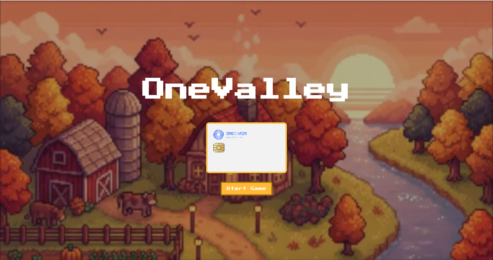

# OneValley-OneChain-Hackathon

A Stardew Valley-inspired blockchain game built with Phaser 3, Next.js, and OneChain.



## 📖 Project Description

**OneValley** is a web-based RPG that blends the charm of classic farming simulations with the power of the OneChain blockchain. Players can manage their own farms, gather resources, craft items, and engage in a player-owned economy.

Key features include:
- **Farming & Gathering**: Plant crops, water them, and harvest produce. Cut trees for wood and gather other materials.
- **Social Interaction**: Visit other players' farms and chat in real-time.
- **Player-Owned Economy**: Trade items with other players or buy/sell on the marketplace using in-game currency.
- **Blockchain Integration**: Secure ownership of assets (crops, items, pets) and currency on the OneChain network.
- **Pets**: Tame and raise pets to assist with farming tasks.

## 🎮 Game Flow

### 1. Onboarding
Players start by connecting their ONECHAIN wallet to enter the game world.
(screenshot of login/connect wallet screen)

### 2. Farming & Resource Gathering
Manage your farm plot! Till the soil, plant seeds, water crops, and harvest them when they're ready. You can also explore to cut trees and gather resources.
(screenshot of farming gameplay - planting or watering)

### 3. Social & Visiting
Travel to the town or visit your friends' farms. You can chat with other players you meet in the world.
(screenshot of player visiting another farm or chatting)

### 4. Economy & Trading
Head to the marketplace to trade your harvested goods or crafted items. Buy seeds, tools, and unique outfits from other players or NPCs.
(screenshot of marketplace or trading interface)

## 🛠 Tech Stack

- **Frontend**: [Next.js](https://nextjs.org/) (React), TypeScript
- **Game Engine**: [Phaser 3](https://phaser.io/)
- **Blockchain**: OneChain by OneLab
    - SDK: `@onelabs/sui`
    - Auth: zkLogin
    - Standards: Kiosk (for marketplace), Fungible Tokens (currency)
- **Styling**: Tailwind CSS

## 🚀 Getting Started

### Prerequisites
- [Node.js](https://nodejs.org/) (v18 or higher recommended)

### Installation

1.  **Clone the repository:**
    ```bash
    git clone https://github.com/your-username/OneValley-OneChain-Hackathon.git
    cd OneValley-OneChain-Hackathon
    ```

2.  **Install dependencies:**
    ```bash
    npm install
    ```

3.  **Run the development server:**
    ```bash
    npm run dev
    ```

4.  **Open the game:**
    Open [http://localhost:8080](http://localhost:8080) in your browser.

### Build for Production

To create a production build:

```bash
npm run build
```

The output will be in the `dist` folder.

## 📂 Project Structure

| Path | Description |
| :--- | :--- |
| `src/game` | Core Phaser game logic (Scenes, Objects). |
| `src/PhaserGame.tsx` | Bridge component between React and Phaser. |
| `src/pages` | Next.js pages and routing. |
| `public/assets` | Game assets (sprites, tilesets, audio). |

## 📜 License

[MIT](LICENSE)
